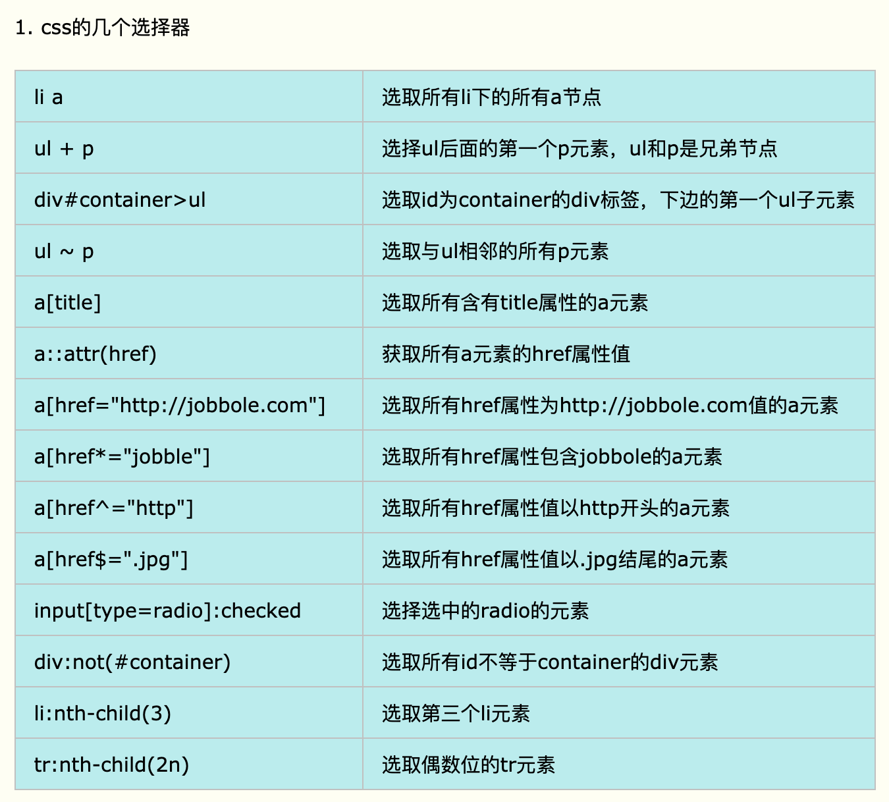

# scrapy学习笔记

## 基本操作
### 项目创建及启动
1. 新建项目 scrapy startproject xxx(项目名称)
2. 启动方式 scrapy crawl SpiderName.标识蜘蛛。它在一个项目中必须是唯一的，也就是说，不能为不同的蜘蛛设置相同的名称。
3. scrapy shell 'http://quotes.toscrape.com/page/1/' 
使用scrappy提取数据的最佳方法是使用 Scrapy shell

### 链接跟踪
```
    方法1
    next_page = response.urljoin(next_page)
    yield scrapy.Request(next_page, callback=self.parse)
    方法2
    yield response.follow(next_page, callback=self.parse)
```

### 四种常见爬虫
1. CrawlSpider 方便用于追踪链接
2. XMLFeedSpider 方便XML分析
3. CSVSpider 按行读取csv文件
4. SitemapSpider 爬取网站的sitemap信息

### 3种选择器
1. css选择器
    
2. xpath选择器
3. 内置选择器


